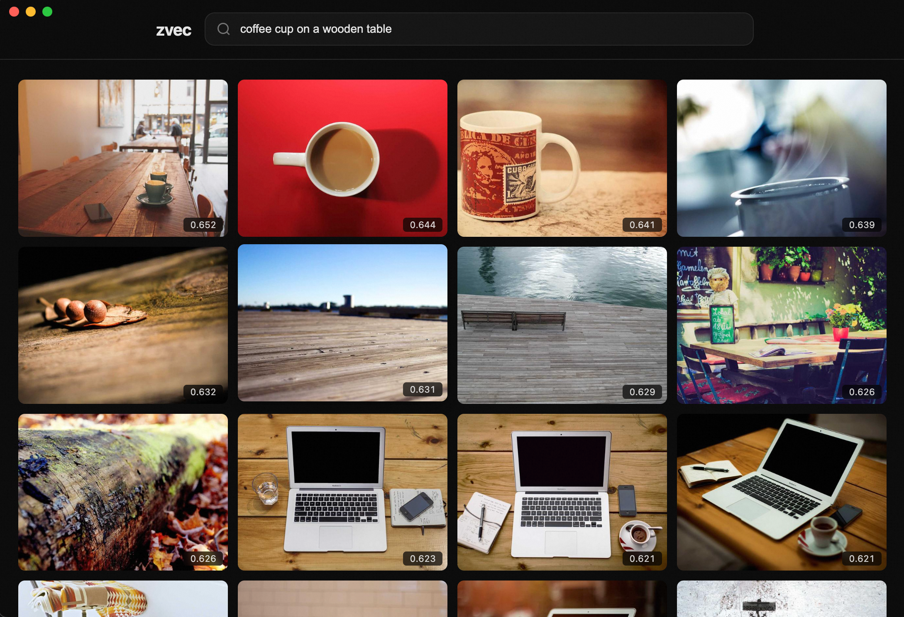

# zvec-electron-image-search

A local multimodal image search desktop app powered by [zvec](https://www.npmjs.com/package/@zvec/zvec) and [CLIP](https://huggingface.co/Xenova/clip-vit-base-patch32). Type natural language queries and instantly find semantically matching images from your local library — all running offline on your machine.

[](https://github.com/feihongxu0824/zvec-electron-image-search/actions/workflows/ci.yml)



## Features

- **Natural language image search** — describe what you're looking for in plain English
- **Fully local** — CLIP inference and vector search run entirely on your machine, no cloud API needed
- **Cross-platform** — works on Windows, macOS, and Linux
- **Cosine similarity scores** — each result shows how closely it matches your query
- **Copy to clipboard** — click to copy any result image directly
- **Lightbox preview** — click any image for a full-size view

## Prerequisites

| Dependency | Version |
|------------|---------|
| Node.js    | >= 18   |
| npm        | >= 8    |

## Quick Start

```bash
# Clone the repo
git clone https://github.com/feihongxu0824/zvec-electron-image-search.git
cd zvec-electron-image-search

# Install dependencies
npm install

# (Optional) If HuggingFace is not accessible, use a mirror
export HF_ENDPOINT=https://hf-mirror.com

# Launch the app
npm start
```

## First Launch

On the first run, the app automatically completes three setup stages (requires internet):

1. **Download CLIP model** — fetches the quantized `clip-vit-base-patch32` model from HuggingFace (~150 MB)
2. **Download sample images** — downloads 200 sample images from [Lorem Picsum](https://picsum.photos)
3. **Build vector index** — extracts a 512-dim feature vector for each image using CLIP and indexes them with zvec

This may take a few minutes. A progress indicator is shown in the UI. Once complete, all data is cached locally at `~/.zvec-image-search` — subsequent launches skip the download.

## Usage

After setup, type an English phrase in the search bar (e.g. `coffee cup on a wooden table`, `sunset over the ocean`, `a cat sitting on a chair`). The app converts your text into a CLIP embedding, performs a cosine similarity search against the zvec index, and returns the top 20 matching images ranked by relevance score.

## Tech Stack

| Component | Role |
|-----------|------|
| [Electron](https://www.electronjs.org/) | Cross-platform desktop shell |
| [@huggingface/transformers](https://www.npmjs.com/package/@huggingface/transformers) | CLIP model inference in Node.js |
| [onnxruntime-node](https://www.npmjs.com/package/onnxruntime-node) | ONNX model runtime engine |
| [@zvec/zvec](https://www.npmjs.com/package/@zvec/zvec) | Lightweight vector database for storing and searching image embeddings |

## License

MIT
